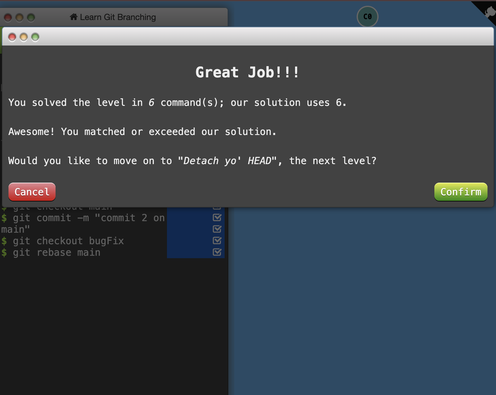
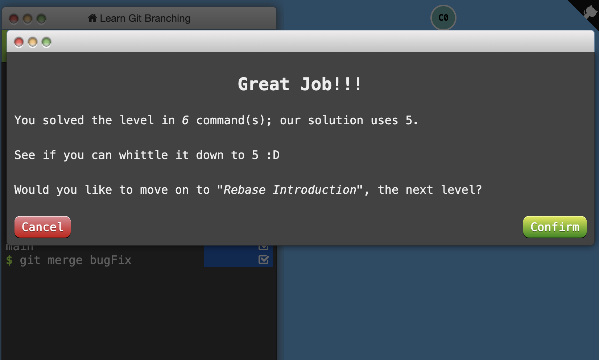
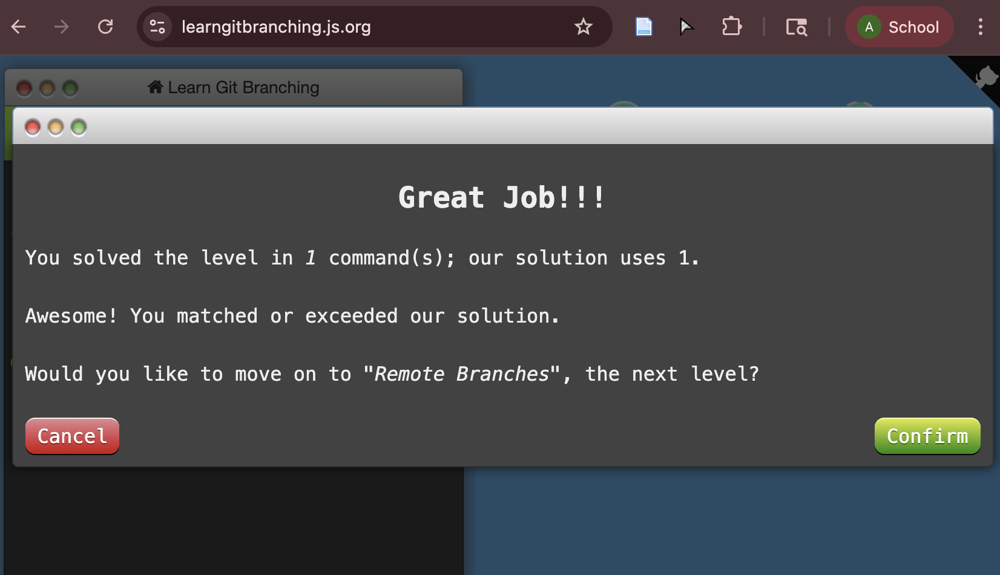
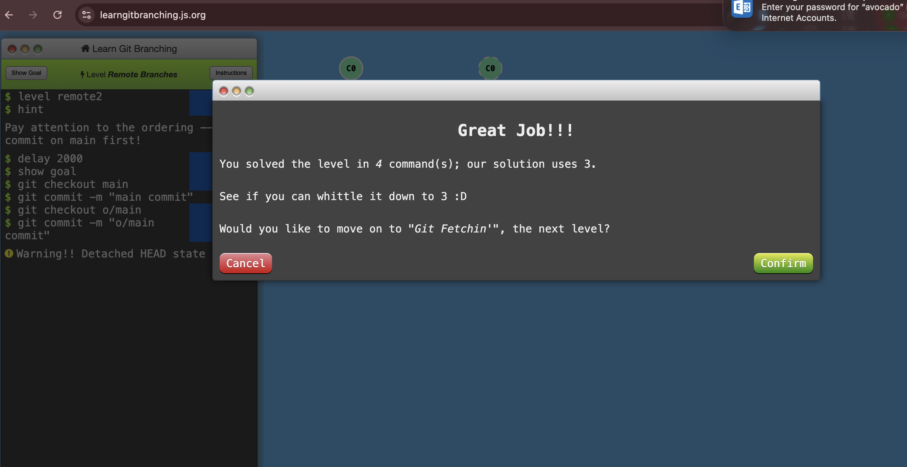
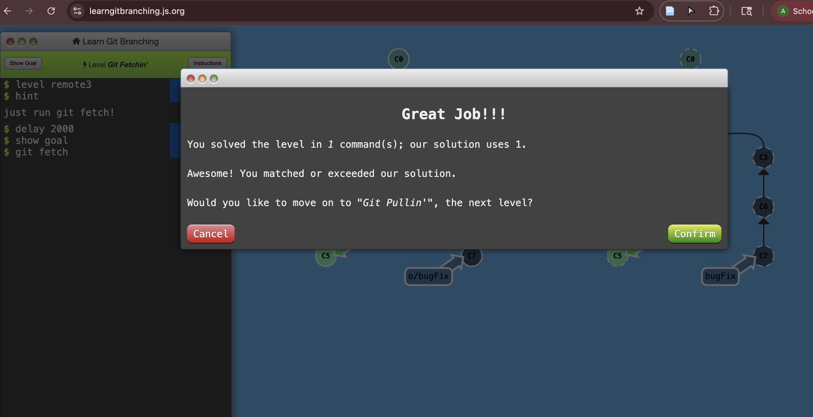
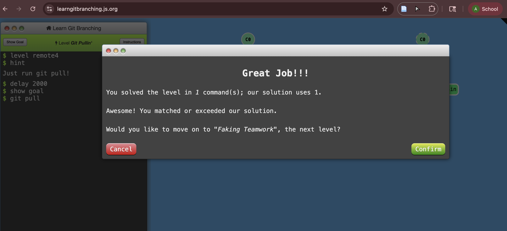
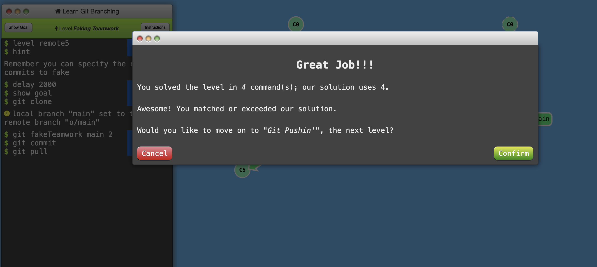
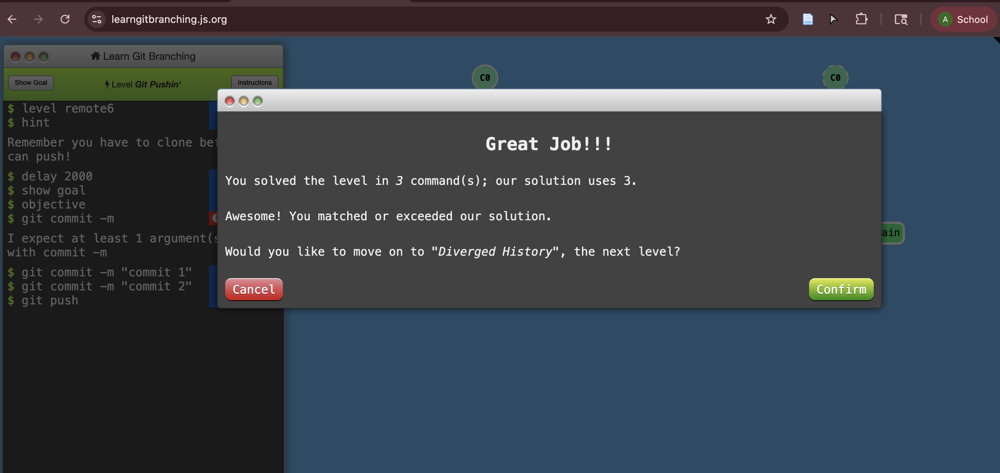
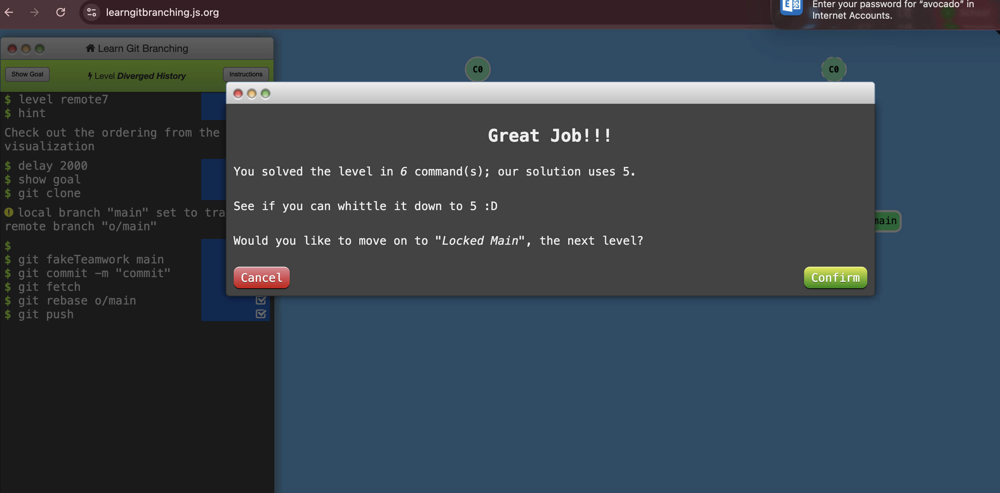
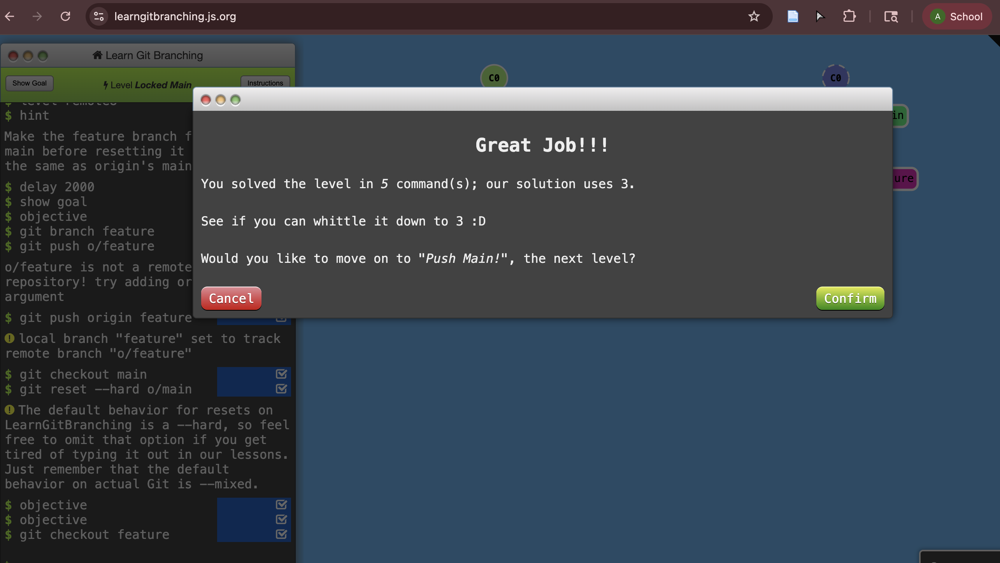

# Write-up 0: template

**Name:** Angelica Alvarado
**Student ID:** avocado  
**Date:** 11/11/2025  

Part A:
Q1. Git provides a history of content changes
Q2. git log --graph

Part B
Introduction Sequence:

Push & Pull:

